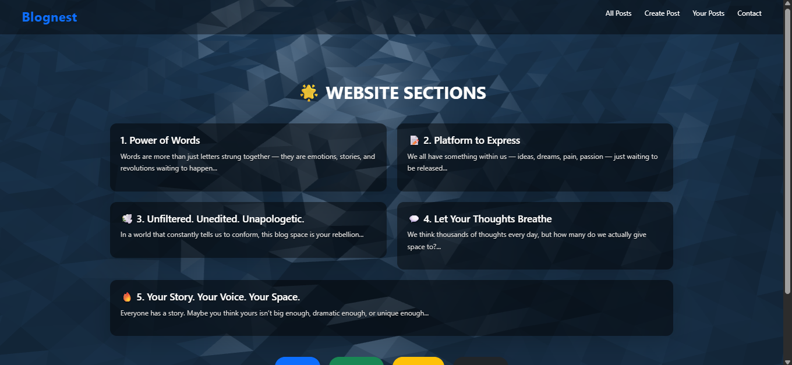

<h1 align="center">📝 Blognest</h1>

A clean, minimalist full-stack blogging platform built using Node.js, Express.js, and Vanilla JS.

  
  

<h2>📸 Screenshots</h2>

<ul>
  <li><strong>Home Page (All Posts)</strong> 
    
  </li>
  <li><strong>Create Post</strong> 
    
  </li>
  <li><strong>View Post</strong> 
    
  </li>
  <li><strong>Edit Post</strong> 
    
  </li>
</ul>

<h2>🧰 Tech Stack</h2>
<ul>
  <li>Frontend:  CSS3, JavaScript</li>
  <li>Backend: Node.js, Express.js</li>
  <li>Templating Engine: EJS</li>
  <li>Styling Effects: Vanta.js for animated backgrounds</li>
</ul>

<h2>⚙️ Installation & Setup</h2>
<pre>
git clone https://github.com/shaurya174/Blognest.git
cd Blognest
npm install
</pre>

<h3>📦 To Start the Server:</h3>
<pre>
node index.js
</pre>

Visit <code>http://localhost:3000</code> in your browser to see it live.

<h2>📁 Folder Structure</h2>
<pre>
Blognest/
├── public/         # Static assets (CSS, JS)
├── views/          # EJS Templates
├── screenshots/    # Project screenshots
├── index.js        # Main server file
├── package.json
</pre>

<h2>✨ Features</h2>
<ul>
  <li>Create, view, edit, and delete blog posts</li>
  <li>Simple and responsive design</li>
  <li>Posts displayed in a 3-per-row grid layout</li>
  <li>Interactive UI with dynamic updates</li>
  <li>Have a contact form with all social media handle links.</li>
</ul>

<h2>🙋‍♂️ Author</h2>

<strong>Shaurya Mittal</strong> – Developer, Learner, and aspiring Full Stack Engineer,ML Enthusiast and a software developer 🚀

  🔗 <a href="https://github.com/shaurya174" target="_blank">GitHub</a> |
  💼 <a href="https://www.linkedin.com/in/your-link-here" target="_blank">LinkedIn</a>

<h2>📢 Contributions</h2>

Pull requests are welcome! If you'd like to improve something or report bugs, feel free to raise an issue.

<h2>🌐 Live Demo</h2>

Coming soon on <strong>Render</strong> or <strong>Streamlit Cloud</strong> (or you can host locally).

